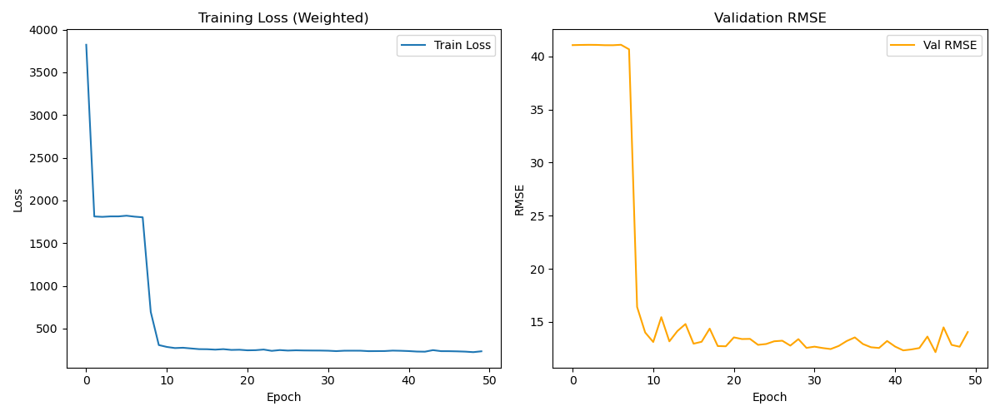
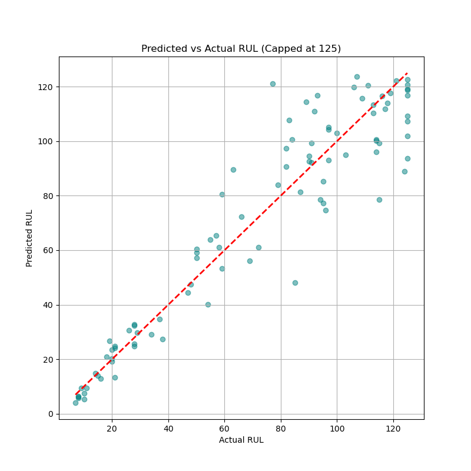
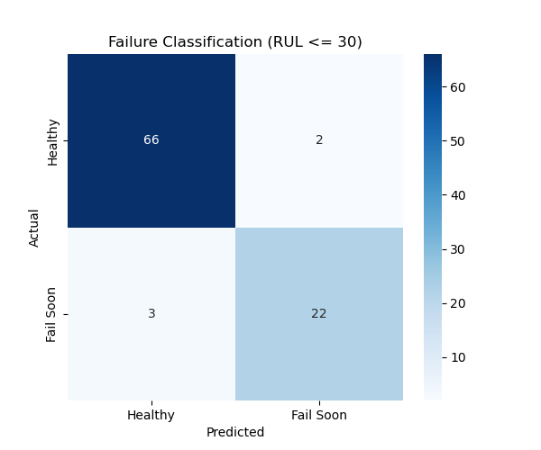

# Predictive Maintenance ML - Turbofan Engine RUL Prediction

This repository contains an advanced machine learning system for **Remaining Useful Life (RUL)** prediction and **failure classification** of turbofan engines using sensor time-series data (NASA CMAPSS).

## 🚀 Key Features
- **Dual-Head LSTM**: Simultaneously performs regression (RUL prediction) and binary classification (imminent failure detection).
- **Industrial Preprocessing**: Sensor selection (dropping 7 low-variance sensors), rolling statistics, and piecewise linear RUL capping (125 cycles).
- **Advanced Metrics**: Evaluated using RMSE, MAE, and the industry-standard NASA Score function.
- **Production-Ready API**: FastAPI service with batch processing and health monitoring.

## 📊 Model Architecture
The model uses a shared LSTM backbone (2 layers, 100 hidden units, 0.2 dropout) with two specialized heads.
- **Loss Function**: Weighted sum of MSE (Regression) and Binary Cross Entropy (Classification).
  - $Loss = Loss_{MSE} + 10 \times Loss_{BCE}$
  - The classification head is weighted higher to ensure high sensitivity to imminent failure.

```mermaid
graph TD
    A[Input Sequence 50x17] --> B[LSTM Layer 1 (dropout=0.2)]
    B --> C[LSTM Layer 2 (dropout=0.2)]
    C --> D[Shared Representation]
    D --> E[Regression Head (Linear)]
    D --> F[Classification Head (Sigmoid)]
    E --> G[RUL Prediction]
    F --> H[Failure Prob < 30 Cycles]
```

## 📉 Results (Official FD001 Test Set)
| Model | RMSE | MAE | NASA Score | Precision | Recall | F1-Score |
|-------|------|-----|------------|-----------|--------|----------|
| XGBoost Baseline | 86.20 | - | - | - | - | - |
| **Dual-Head LSTM** | **13.33** | **9.52** | **281.05** | **0.92** | **0.88** | **0.90** |

*The LSTM captures temporal degradation trends, achieving high precision in both remaining life estimation and imminent failure detection.*

## 🖼️ Visualizations
### Training History


### Predicted vs Actual RUL


### Failure Classification


## ⚠️ Limitations
- **Dataset Scope**: The current model is trained and validated exclusively on the **FD001** subset (single operating condition, single fault mode).
- **Environmental Factors**: Performance on multi-condition datasets (FD002/FD004) would require additional domain adaptation or more complex feature normalization.
- **Data Scaling**: The piecewise RUL cap of 125 cycles is specific to the CMAPSS literature and may vary for different industrial engines.

## 🛠️ Getting Started
1. **Setup**: `pip install -r requirements.txt`
2. **Train**: `python src/train.py`
3. **Evaluate**: `python src/evaluate_final.py`
4. **Predict**: `uvicorn api.main:app --reload`

## 🔌 API Usage
- `GET /health`: System health check.
- `POST /predict`: RUL prediction for a single sequence.
- `POST /predict/batch`: Batch prediction for multiple units.
